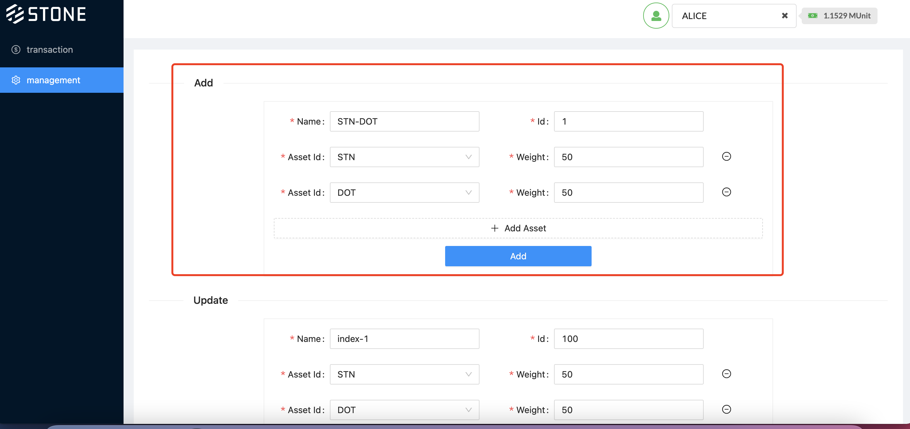
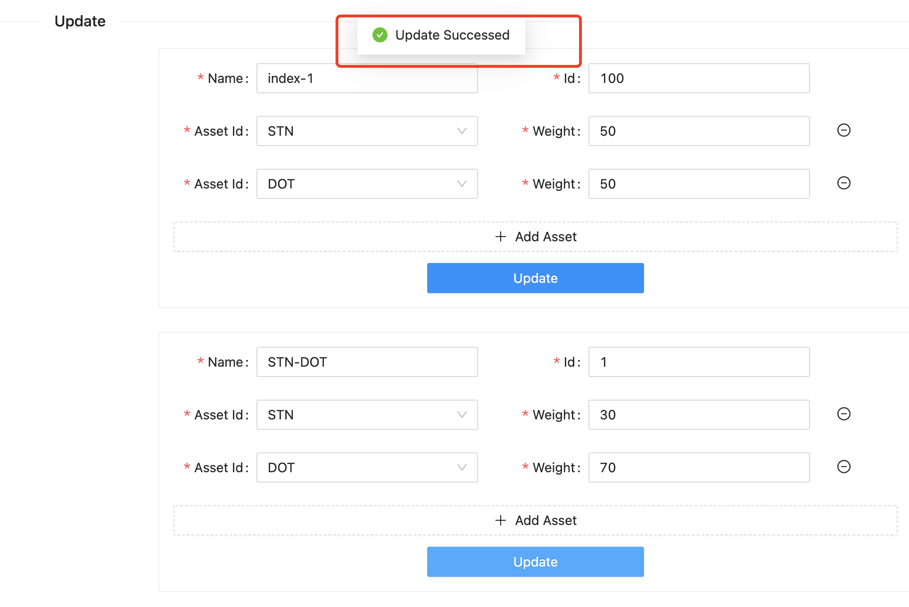
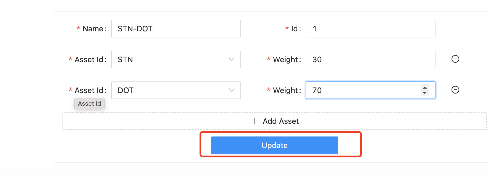
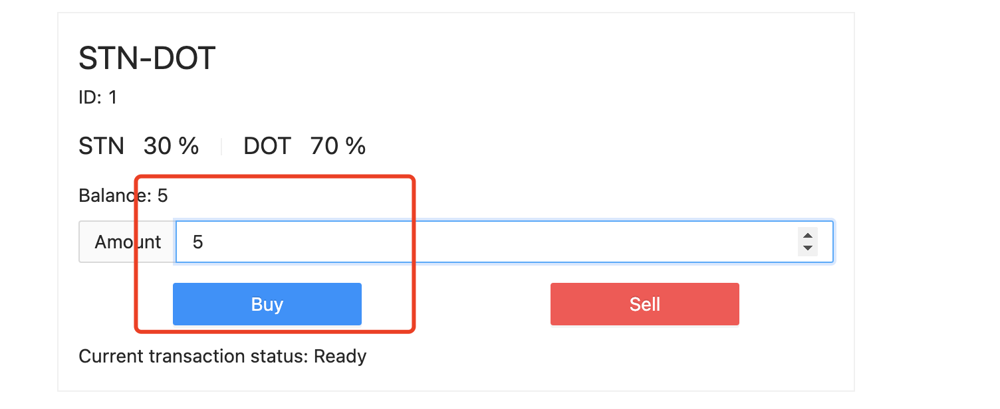
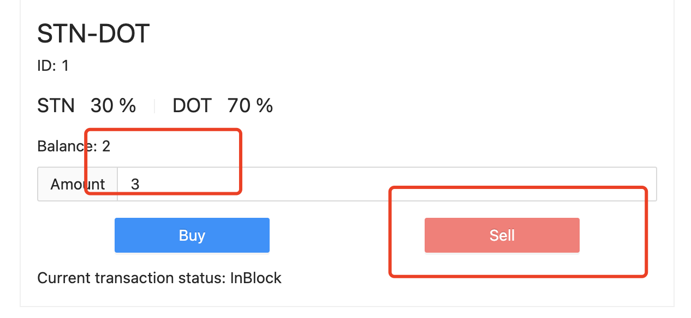

# Stone Index on Substrate

## General Notes
Stone Index on Substrate project is an experimental open sourced project built on Substrate framework, the project has a few dependencies like Polkadot parachain with Swap, Wrapped Assets and etc., hence it's not production ready, use at your own risks.

## General usage guide
* You must install the https://github.com/stonedefi/stone-index-substrate-ui and https://github.com/stonedefi/stoneindex-node, then run both apps successfully
* Go to http://localhost:3000
### Add a new Index
* Click management in the menu  
* Edit the form with necessary info in Add section
* Click Add button
* If everything works, it will popup update successfully

### Update a new Index
* Click management in the menu  
* Edit info in any existing index in update section
* Click Update button
* If everything works, it will popup update successfully the same

### User to buy a new Index
* In the landing page, a list of available indexes are listed, user can choose any one to buy

* Key in the amount user want to buy and click Buy button

### User to sell an index he(she) has
* In the landing page, a list of available indexes are listed, user can choose any index he(she) has balance

* Key in the amount user want to sell and click Sell button, the amount cannot more than balance of the index